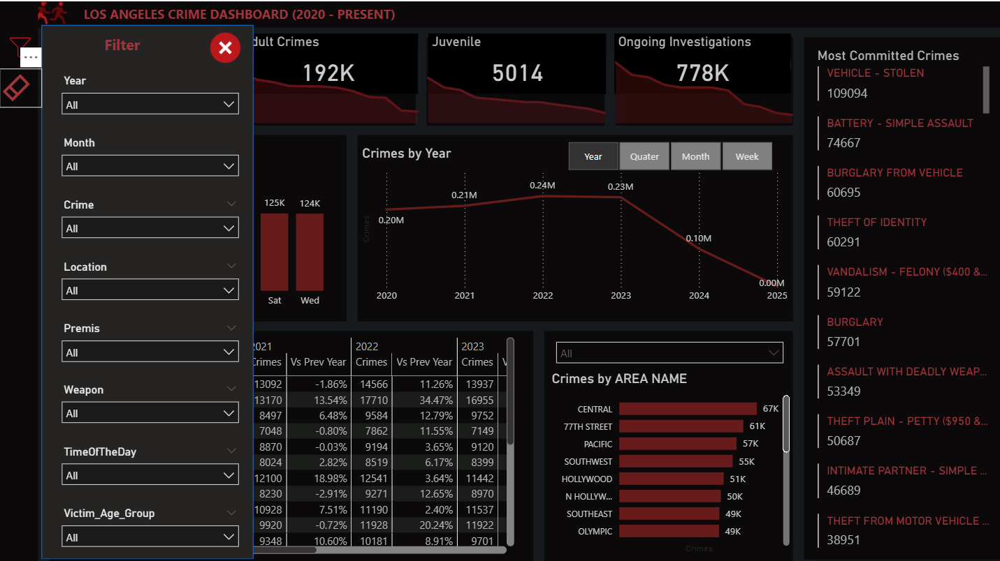
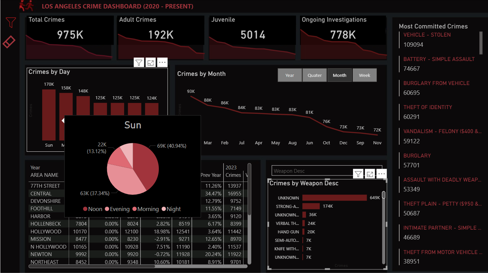
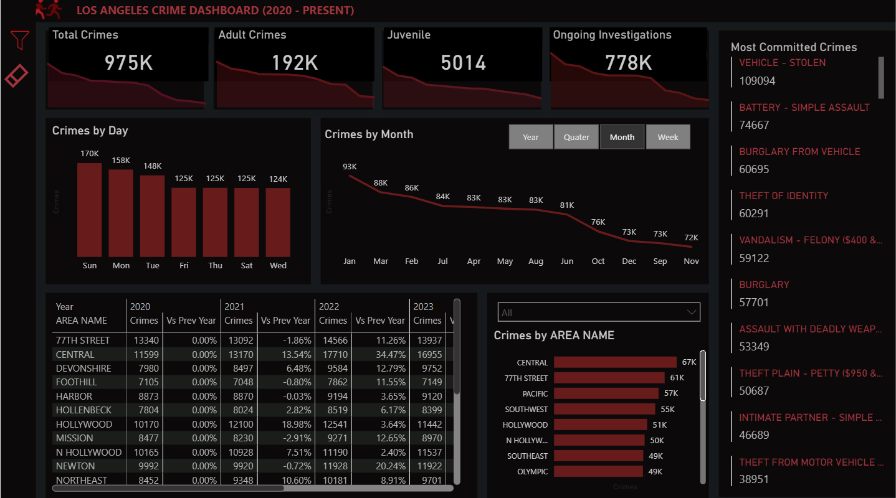

# 🕵️‍♂️ LAPD Crime Analytics Dashboard (2020–2025)

**Tools:** Power BI · Excel Power Query · Power BI Data Modeling · DAX · M Language  
**Data Size:** 1.2M+ Records | 6 Years of Historical Crime Data
👉 [Click here to explore the interactive LAPD Crime Analytics Dashboard (2020–2025)](https://app.powerbi.com/reportEmbed?reportId=6c684d33-bbc4-4622-b88d-70d22181131f&autoAuth=true&ctid=a8eec281-aaa3-4dae-ac9b-9a398b9215e7)

---

## 🔍 Project Summary

A fully automated **end-to-end analytics platform** built to unify six years of LAPD open crime data (2020–2025) into a powerful, real-time **dashboard for crime trend analysis**, location-based incidents, and time-of-day insights. Designed to **support data-driven public safety decisions**, optimize resource deployment, and reduce manual reporting time by 90%.

---

## 🎯 Real-World Problem

Los Angeles releases crime data in fragmented yearly files, with schema inconsistencies and no centralized view. Stakeholders—such as law enforcement, policymakers, and city analysts—struggled to:

- Identify patterns over time or by district
- Combine historical data for macro-level insights
- Quickly generate reports or take timely action

---

## 🛠️ Solution Overview

This project solves the above by:

- Integrating 6 years of LAPD crime data using **Power Query folder ingestion**
- Cleaning, transforming, and modeling 1.2M+ records using **Power BI, M Language, and star schema**
- Delivering a **drillable, real-time dashboard** with zero manual rework for future updates

---

## 📈 Key Deliverables & Real-Time Impacts

✅ **📂 90% Reduction in Manual Workload**  
- Used Power Query folder automation to load yearly datasets dynamically  
- Eliminated repetitive Excel merge tasks through parameterized queries  

✅ **🧹 Improved Data Accuracy & Consistency Across 1.2M+ Records**  
- Cleaned inconsistent column structures using M scripting  
- Applied normalization logic to standardize key fields like Area, Crime Type, Status  

✅ **⚡ High-Performance Data Model with Star Schema**  
- Built fact and dimension tables (Date, Crime Type, District, Time)  
- Boosted dashboard responsiveness and enabled multi-dimensional filtering  

✅ **📊 Interactive Dashboards for Public Safety Teams**  
- Crime heatmaps by **hour of day & day of week**  
- KPIs for arrests, top crime categories, district performance  
- Enabled decision-makers to act on location- and time-sensitive trends  

✅ **📤 Self-Service Reporting for Stakeholders**  
- Slicers and drill-throughs allow on-demand exploration  
- Reduced dependency on analysts and engineers for basic reporting  
- **Accelerated insight delivery** for patrol planning, resource prioritization, and crime awareness campaigns  

---

## 🚓 Real-World Use Cases Enabled

- **⚠️ Hotspot Identification**: Visualize crime spikes by hour or area to deploy patrol units  
- **📈 Trend Monitoring**: Monitor year-over-year changes to evaluate policy effectiveness  
- **🧭 Resource Allocation**: Compare districts to allocate personnel based on crime volume  
- **🧑‍💼 Stakeholder Reporting**: Create stakeholder-ready exports in seconds for internal reviews or public briefings  

---
## 📸 Dashboards

